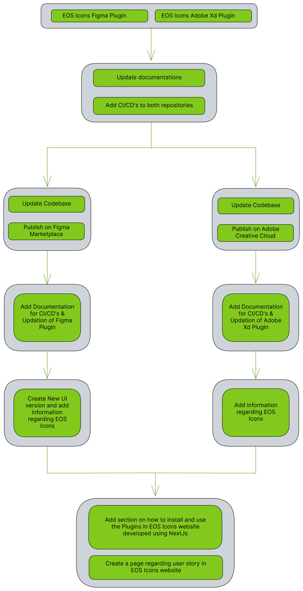

# GSOC-2022-Project-Report

Final report for Google Summer of Code - 2022 at Python Software Foundation (EOS)

## EOS icons - Figma and Adobe Xd plugins and website

## Project Summary

Currently, the eos-icons have developed plugins for Figma and Adobe Xd. Both the plugins were in development phase and the plugins were unpolished and needed to be improved. The goal of the project was to work on both the website for the eos-icons and the development of the plugins. Continuous Integration/Continuous Deployment (CI/CD) were added to both plugin repositories, and users can also learn about the entire workflow and functionality of the plugins via documentation. The project scope also included publishing the Plugins on the Figma Marketplace and Adobe's Creative Cloud. Aside from that, a new UI is created improving the appearance of the Figma Plugin & refactoring the UI in such a manner that it includes a link to eos-icons so that users may learn more about it. The scope of the project also involves adding information in eos-icons.com about User Story to help users learn that they can request new icons via User Story.

## Development Process

## Contributions

### EOS Icons Figma Plugin

| S No. |   Contribution     |
|  ---  |       ---          |
| 1 |[Added documentation for the plugin providing relevant test commands and how to run the plugin.](https://github.com/EOS-uiux-Solutions/eos-icons-figma/pull/38)|
| 2 |[Configured semantic release for the figma repo based on eslint conventions](https://github.com/EOS-uiux-Solutions/eos-icons-figma/pull/41)|
| 3 |[Generated new manifest Id for the plugin](https://github.com/EOS-uiux-Solutions/eos-icons-figma/pull/48)|
| 4 |Designed cover arts for the Plugin|
| 5 |[Published EOS Icons Figma Plugin on Figma Community](https://www.figma.com/community/plugin/1131638845835688020)|
| 6 |[Added modal to the plugin to provide information about the eos-icons](https://github.com/EOS-uiux-Solutions/eos-icons-figma/commit/7339263fd3bd3d98e7f910b4d7fad30f87a2ab2c)|
| 7 |[Designed & Updated the current UI for the Figma Plugin giving a new look](https://github.com/EOS-uiux-Solutions/eos-icons-figma/commit/7339263fd3bd3d98e7f910b4d7fad30f87a2ab2c)|

### EOS Icons Adobe Xd Plugin

| S No. |   Contribution     |
|  ---  |       ---          |
| 1 |[Added documentation for the plugin providing relevant test commands and how to run the plugin](https://github.com/EOS-uiux-Solutions/eos-icons-adobe-xd/pull/30)|
| 2 |[Configured semantic release for the adobe repo based on eslint conventions](https://github.com/EOS-uiux-Solutions/eos-icons-adobe-xd/pull/35)|
| 3 |[Generated new manifest Id for the plugin](https://github.com/EOS-uiux-Solutions/eos-icons-adobe-xd/pull/40)|
| 4 |[Changed state from HandleOnClick to HandleOnChange and debugged the Debounce Hook](https://github.com/EOS-uiux-Solutions/eos-icons-adobe-xd/pull/40)|
| 5 |[Modified the API to fetch the icons properly and reduce the loading time](https://github.com/EOS-uiux-Solutions/eos-icons-adobe-xd/pull/41)|
| 6 |Designed cover arts for the Plugin|
| 7 |[Published EOS Icons Adobe Xd Plugin on Adobe Creative Cloud](https://exchange.adobe.com/creativecloud/plugindetails.html/app/cc/f7ecf6b5?pluginId=f7ecf6b5)|
| 8 |[Added a section to the plugin providing information about the eos-icons](https://github.com/EOS-uiux-Solutions/eos-icons-adobe-xd/pull/42)|

### EOS Icons Website

| S No. |   Contribution     |
|  ---  |       ---          |
| 1 |[Added a section to the website providing information about the Figma Plugin](https://github.com/EOS-uiux-Solutions/eos-icons-frontend/pull/11)|
| 2 |[Added a section to the website providing information about the Adobe Xd Plugin](https://github.com/EOS-uiux-Solutions/eos-icons-frontend/pull/11)|
| 3 |[Fixed indexing issues with gifs in the website](https://github.com/EOS-uiux-Solutions/eos-icons-frontend/pull/12)|
| 4 |Started to develop a section to the website providing information about the user-story|

### EOS Icons Wiki

| S No. |   Contribution     |
|  ---  |       ---          |
| 1 |[Added documentation on how to update EOS Icons Figma Plugin](https://github.com/EOS-uiux-Solutions/wiki/pull/10)|
| 2 |[Added documentation on how to update EOS Icons Figma Plugin](https://github.com/EOS-uiux-Solutions/wiki/pull/10)|

## More info about the project:

Adobe Xd Plugin <a href="https://github.com/EOS-uiux-Solutions/eos-icons-adobe-xd/pulls?q=is%3Apr+author%3AAnshumanDhiman">contributions</a>

Figma Plugin <a href="https://github.com/EOS-uiux-Solutions/eos-icons-figma/pulls?q=is%3Apr+author%3AAnshumanDhiman">contributions</a>

Eos Icons Website <a href="https://github.com/EOS-uiux-Solutions/eos-icons-frontend/pulls?q=is%3Apr+author%3AAnshumanDhiman">contributions</a>

## My Journey

I have written blogs each week, documenting my journey through the entire GSOC period. You can find them here <a href="https://blogs.python-gsoc.org/en/anshumandhimans-blog/">GSoC 2022 Anshuman Dhiman Blogs</a>

## Future Work

- Adding support for exporting icons of a specified size and color.
- Adding a favourite colors panel to the UI.
- Adding a drag-and-drop feature to the plugin.

## Thank You

Time flew so fast and here I am approaching the end of GSoC. I am really glad that I got the opportunity to participate on GSoC 2022. I would like to heartily thank my mentors for guiding and helping me whenever I got stuck.It was hard to figure out the bugs and the issues coming but mentors helped me a lot during this. I would also like to thank EOS Design Systems and Python Software Foundation for giving me this opportunity. I will keep contributing to EOS in the future. 